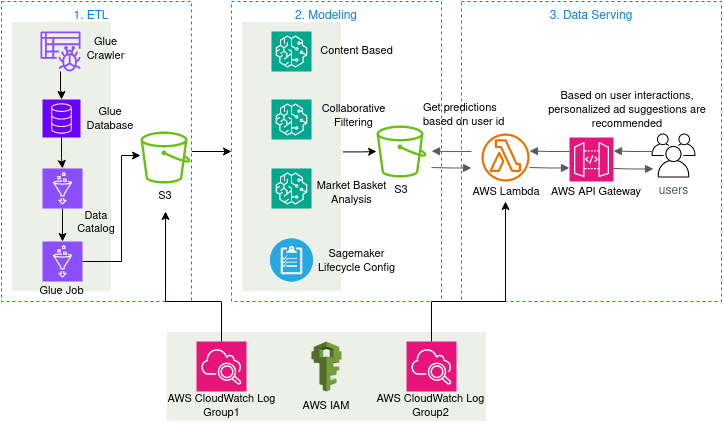

# Ads Personalization Recommendation System

## Table of Contents
- [Introduction](#introduction)
- [Data](#data)
- [Recommendation Strategies](#recommendation-strategies)
- [Tech Stack](#tech-stack)

---

## Introduction
The project aims at curating and serving highly personalized ads to users. By using advanced machine learning and data processing techniques, this system predicts the most relevant ads for individual users, optimizing both user satisfaction and conversion rates.

---

## Data
Our decision-making process is informed by five datasets:

1. **ads_content.csv**: Metadata about advertisements – their ID, title, description, category, and tags.
2. **item_item_interaction.csv**: Details of interactions between pairs of ads, indicating potential complementary or related advertisements.
3. **transactions.csv**: A history of transactions, associating each with a specific user and the ads involved.
4. **user_ad_interaction.csv**: Captures the various ways users interact with ads, be it through clicks, views, or skips.
5. **user_profiles.csv**: Provides a deeper insight into our users with details such as age, gender, location, and personal interests.

---

## Recommendation Strategies

### Content-based Filtering
- **Definition**: Content-based filtering revolves around the ad's content and a user's profile. The system recommends ads by comparing the content of the ads and the user's profile. Content attributes might include the words in the ad's title or description, its category, or tags.
- **Use in Ads Personalization**: If a user frequently interacts with ads about "technology", the system will infer a preference and suggest more tech-related ads.

### Collaborative Filtering
- **Definition**: Collaborative filtering is based on past interactions of users. This method doesn't require explicit ad content. Instead, it predicts a user's interests by collecting preferences from many users (collaborating). The underlying assumption is that if two users agree on one issue, they will likely agree on others as well.
- **Use in Ads Personalization**: If user A and user B both liked ads X and Y, and user A liked ad Z, the system might recommend ad Z to user B.

### Market Basket Analysis (MBA)
- **Definition**: MBA is a technique that analyzes the combinations of ads in which users often engage. Think of it as understanding what ads are frequently "bought" together in the digital space.
- **Use in Ads Personalization**: If users frequently interact with ads A and B at the same time, then when another user interacts with ad A, they might also be interested in seeing ad B.

## Tech Stack

Spark, Hadoop, AWS Glue, Sagemaker